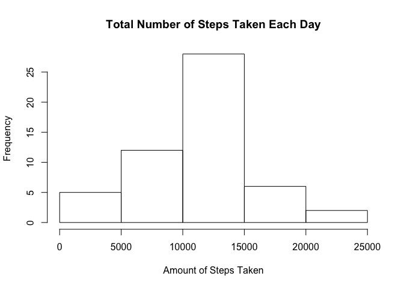
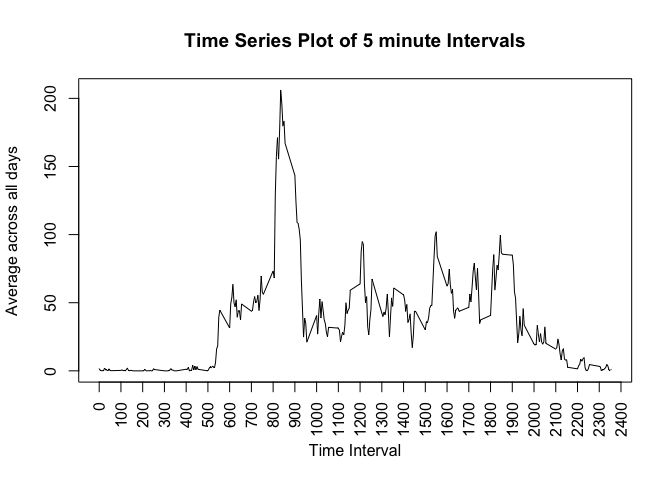
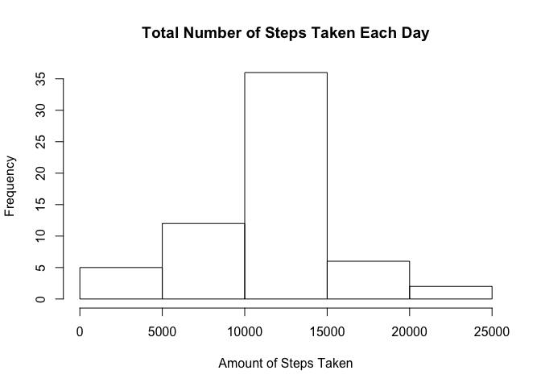
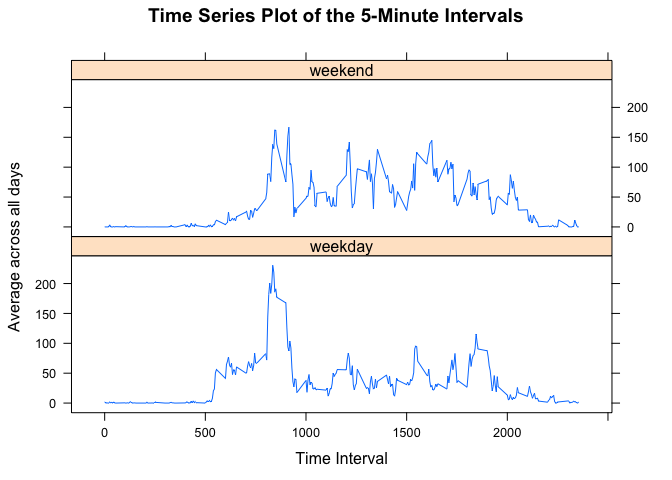

# PA1_template.Rmd
Amelia Stone  
April 23, 2016  


```r
## Set working directory
setwd("~/Desktop/RepData_PeerAssessment1")

## Read data into R
activity <- read.csv("activity.csv")

## Reclassifies the entries in the date column as a date class
act <- transform(activity, date = as.Date(date))
```

### 1. What is mean total number of steps taken per day?

```r
## Computes the total number of steps taken per day
tapply(act$steps, act$date, sum)
```

```
## 2012-10-01 2012-10-02 2012-10-03 2012-10-04 2012-10-05 2012-10-06 
##         NA        126      11352      12116      13294      15420 
## 2012-10-07 2012-10-08 2012-10-09 2012-10-10 2012-10-11 2012-10-12 
##      11015         NA      12811       9900      10304      17382 
## 2012-10-13 2012-10-14 2012-10-15 2012-10-16 2012-10-17 2012-10-18 
##      12426      15098      10139      15084      13452      10056 
## 2012-10-19 2012-10-20 2012-10-21 2012-10-22 2012-10-23 2012-10-24 
##      11829      10395       8821      13460       8918       8355 
## 2012-10-25 2012-10-26 2012-10-27 2012-10-28 2012-10-29 2012-10-30 
##       2492       6778      10119      11458       5018       9819 
## 2012-10-31 2012-11-01 2012-11-02 2012-11-03 2012-11-04 2012-11-05 
##      15414         NA      10600      10571         NA      10439 
## 2012-11-06 2012-11-07 2012-11-08 2012-11-09 2012-11-10 2012-11-11 
##       8334      12883       3219         NA         NA      12608 
## 2012-11-12 2012-11-13 2012-11-14 2012-11-15 2012-11-16 2012-11-17 
##      10765       7336         NA         41       5441      14339 
## 2012-11-18 2012-11-19 2012-11-20 2012-11-21 2012-11-22 2012-11-23 
##      15110       8841       4472      12787      20427      21194 
## 2012-11-24 2012-11-25 2012-11-26 2012-11-27 2012-11-28 2012-11-29 
##      14478      11834      11162      13646      10183       7047 
## 2012-11-30 
##         NA
```

```r
## Prints a histogram of the total amount of steps taken each day
hist(tapply(act$steps, act$date, sum), xlab = "Amount of Steps Taken", main = "Total Number of Steps Taken Each Day")
```



```r
##Computes the mean of the total steps taken per day
mean(tapply(act$steps, act$date, sum), na.rm=TRUE)
```

```
## [1] 10766.19
```

```r
## Computes the median of the total steps taken per day
median(tapply(act$steps, act$date, sum), na.rm=TRUE)
```

```
## [1] 10765
```

### 2. What is the average daily activity pattern?

```r
##Computes the mean steps per interval over all days and displays the info as a data frame
intmean <- aggregate(steps ~ interval, act, mean)

## Prints a time series plot displaying the average amount of steps taken, averaged across all days.
plot(intmean, type = "l", xlab = "Time Interval", xaxt = "n", ylab = "Average across all days", main = "Time Series Plot of 5 minute Intervals")
axis(1, at = seq(0, 2400, by = 100), las=2)
```



```r
## Produces the time interval that contains the maximum number of steps on average as well as the amount of steps.
intmean[which.max(intmean$steps),]
```

```
##     interval    steps
## 104      835 206.1698
```

### 3. Imputing missing values

```r
## Computes the amount of missing values in our data set (determined by NAs in the "steps" column).
nrow(act[is.na(act),])
```

```
## [1] 2304
```

```r
## One method for filling in the missing values is to replace the NAs with the mean of that particular interval from across all days.

## The following merges the original data set with the previously computed mean steps per interval over all days
new <- merge(act, intmean, by = 'interval', all.y = F)

## The elements of the steps.x column is an integer meanwhile the elements in steps.y is numeric. The following converts the steps.y into an integer vector and converts the NA values to the relevant averages.
new$steps.x[is.na(new$steps.x)] <- as.integer(new$steps.y[is.na(new$steps.x)])

## Transforms the data frame to eliminate the additional columns
new <- transform(new, steps = steps.x, steps.x = NULL, steps.y = NULL)
## Switches the order of the columns to match the original ordering
new <- new[,c(3,2,1)]
## Reorders the date column to match that of the original data frame
new <- new[order(new$date),]

## Prints a histogram of the new total amount of steps taken each day
hist(tapply(new$steps, new$date, sum), xlab = "Amount of Steps Taken", main = "Total Number of Steps Taken Each Day")
```



```r
##Computes the new mean of the total steps taken per day
mean(tapply(new$steps, new$date, sum), na.rm=TRUE)
```

```
## [1] 10749.77
```

```r
## Computes the new median of the total steps taken per day
median(tapply(new$steps, new$date, sum), na.rm=TRUE)
```

```
## [1] 10641
```

```r
## These values are slightly different from the original but the histogram for the most part looks identical. Inputting the average may have slightly changed the exact values of the mean and median but did not impact the overall distribution.
```

### 4. Are there differences in activity patterns between weekdays and weekends?

```r
## Generate a copy of the existing data frame
final <- new

## Defines what day is a weekend. This is a logical vector.
weekend <- weekdays(final$date) %in% c("Saturday", "Sunday")

## Creates an additional column indicating type of day.
final$typeofday <- "weekday"

## Defines the dates that are weekend days.
final$typeofday[weekend == TRUE] <- "weekend"

## Convert this new column to a factor.
final$typeofday <- factor(final$typeofday)

## Produces a panel plot containing a time series plot of the 5 minute intervals.
library(lattice)
typeofdaymean <- aggregate(steps ~ interval + typeofday, final, mean)

xyplot(
  steps ~ interval | typeofday, typeofdaymean, type = "l", layout = c(1,2),
  main = "Time Series Plot of the 5-Minute Intervals", xlab = "Time Interval",
  ylab = "Average across all days"
)
```



```r
## From this plot we see that on average, there is much more steps recorded and for longer durations during the weekend days compared to the weekday days. 
```


